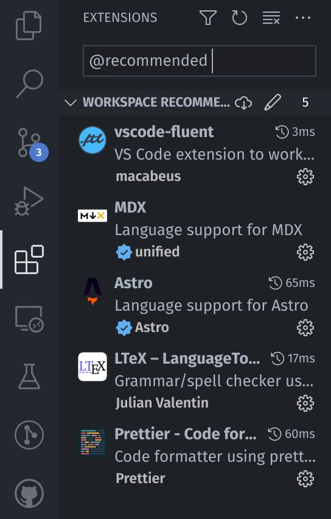

# Quilt Project Website

Website for the Quilt Project.

## Contributing

Thanks for contributing to the site!
There's a couple of things worth noting about our infrastructure, which we will cover below.

### IDE/Editor Choice

For contributors, we recommend using [Visual Studio Code](https://code.visualstudio.com) or [VSCodium](https://vscodium.com/) as your IDE, as it features Astro support via [the official Astro plugin](https://marketplace.visualstudio.com/items?itemName=astro-build.astro-vscode).
Additionally, you would need to install [the MDX plugin](https://marketplace.visualstudio.com/items?itemName=unifiedjs.vscode-mdx) to have syntax highlighting for the `.mdx` files,
and [the `vscode-fluent` plugin](https://marketplace.visualstudio.com/items?itemName=macabeus.vscode-fluent) if you need to translate the site or otherwise tinker with Fluent's `.ftl` files.

In theory, you can use any editor to your liking that supports the [Language Server Protocol](https://microsoft.github.io/language-server-protocol/), hooked up to the [Astro Language Server](https://github.com/withastro/language-tools/tree/main/packages/language-server) and optionally other LSPs for MDX and Fluent.
Unfortunately as of the date of writing (Sept 11, 2022) no pre-built integrations of the Astro Language Server actually exist, which is why we still recommend using VS Code as your IDE.

For VSCode, you should see a popup in the bottom right when you open the project with recommended extensions. You can also type `@recommended` in the extensions page to see the recommended extensions:



### Running the Dev Server

To run the development server, you first need to have `npm`/`pnpm`/`yarn` installed in your system.
Only `pnpm` is regularly used and tested for the site, so you might encounter bugs or incompatibilities using an alternate package manager. [Instructions on how to install `pnpm` can be found on its official installation page.](https://pnpm.io/installation)

Once `pnpm` is installed, clone this repository, navigate into the project folder and run `pnpm i` to install dependencies:
```sh
$ git clone https://github.com/QuiltMC/quiltmc.org
$ cd quiltmc.org
$ pnpm i
```

Once installation is complete, then run `pnpm dev` to start the dev server.
The server application should have an output like this:
```sh
$ pnpm dev

> quiltmc-website@1.0.0 dev
> node csscopy.mjs && astro dev

  🚀  astro  v1.2.1 started in 56ms

  ┃ Local    http://localhost:3000/
  ┃ Network  use --host to expose
```

At this point, open your browser, and you should be able to see the generated site at `localhost:3000`.

As Astro utilizes hot module reloading (HMR), any changes you make would be reflected in the browser quickly.
However, sometimes components and layouts don't get rebuilt with HMR and you might have to restart the Astro server to see your changes, which is easily done by pressing <kbd>Ctrl+C</kbd> and rerunning `pnpm run dev`.

You're all set! Although, I would recommend reading about [the architecture of this site](ARCHITECTURE.md) before making any changes, to familiarize yourself with the project structure. Have fun contributing!

#### Cloudflare Pages Dev server

Some functionalities of the website, such as redirects or functions, use some Cloudflare Pages specific features.
To test these features, you can run the following command:

```sh
$ npx wrangler pages dev -- pnpm dev --host
```

Make sure to use the url provided by wrangler, as it will be different from the one provided by Astro. It should appear underneath `Worker reloaded!`.

### Building

To build the site as seen in production, simply run `pnpm run build`.
Astro will then build the site and emit the output in `dist/`.

```sh
$ pnpm run build
```

To view the built site, you can run `astro preview`:
```sh
$ pnpm preview

> quiltmc-website@1.0.0 preview
> node csscopy.mjs && astro preview

  🚀  astro  v1.2.1 started in 2ms

  ┃ Local    http://localhost:3000/
  ┃ Network  use --host to expose
```

You can then visit the built site at `localhost:3000`.
